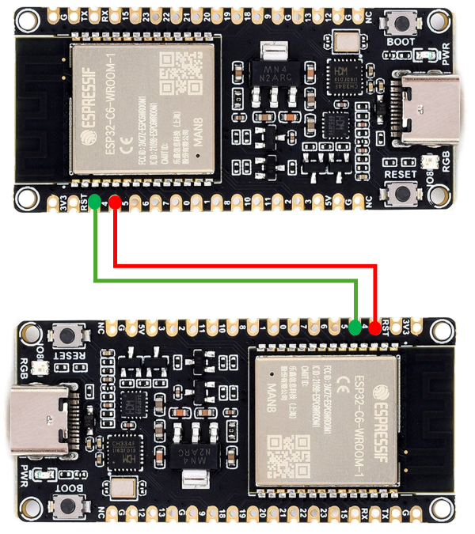

# Transmitter Module: Wi-Fi Transmitter Code

Owner: **Kaveesha Abeysundara** (SID: 201578163)    

Project: **Automated Tracking of Assembly Line-Side Flow Rack Parts**   

School of Mechanical Engineering   
University of Leeds  
LS2 9JT

Arduino firmware for the Wi-Fi transmitter module in an automated flow rack tracking system. This module receives sensor data over UART from an ESP-NOW receiver and synchronizes it with a Firebase Realtime Database.

[](LICENSE.md) <!-- Optional: You can create a LICENSE.md file -->

## Table of Contents

- [About](#about)
- [Hardware Setup](#hardware-setup)
- [Prerequisites](#prerequisites)
- [Installation](#installation)
- [Configuration](#configuration)
- [Usage](#usage)
- [Data Flow & Communication](#data-flow--communication)
- [Repository Structure](#repository-structure)
- [License](#license)
- [Contact](#contact)

## About

The transmitter code reads distance and part-count data sent by sensor modules (via an ESP-NOW receiver over UART), updates and retrieves configuration parameters (rack length, box size) in Firebase RTDB, and forwards live part counts to the cloud. It also sends updated configuration back to the receiver for distribution to sensors.

## Hardware Setup

| Connection       | ESP32 Pin | Description                    |
|------------------|-----------|--------------------------------|
| UART TX          | 4         | Serial output to transmitter   |
| UART RX          | 5         | Serial input from transmitter  |

  

> Ensure the UART pins oppose the reciever's module's RX/TX configuration, and share a common ground.

## Prerequisites

- Arduino IDE v1.8.10+ with ESP32 board support
- **ArduinoJson** library for JSON handling
- **Firebase ESP32** library for database operations
- USB cable and ESP32 development board

## Installation

```bash
git clone https://github.com/kav12ab/transmittercode.git
cd transmittercode
```

1. Open `transmitter.ino` in the Arduino IDE.
2. Install required libraries via **Sketch → Include Library → Manage Libraries**:
   - `ArduinoJson`
   - `Firebase ESP32`
3. Verify board and port settings (Tools → Board: “ESP32 Dev Module”).

## Configuration

Update the following variables at the top of `transmitter.ino` before uploading:

```cpp
#define WIFI_SSID     = "your_ssid";
#define WIFI_PASSWORD = "your_password";
#define FIREBASE_HOST = "your-project.firebaseio.com";
#define FIREBASE_AUTH = "your_database_secret";
```

## Usage

1. Connect the ESP32 to your PC via USB.
2. Upload `transmitter.ino` using the Arduino IDE.
3. Open Serial Monitor at the configured `BAUD_RATE` to view status messages.
4. On startup, the module connects to Wi-Fi, initializes Firebase, and reads/writes configuration.
5. It listens for incoming sensor packets over UART, pushes data to Firebase, and responds with updated configuration.

## Data Flow & Communication

1. **UART In**: Receives CSV or JSON-formatted sensor data from the ESP-NOW receiver.
2. **Parse**: Converts incoming data into internal structures.
3. **Firebase Sync**:
   - Read from `/Config/<RackID>/`
   - Write to `/ReceivedData/<RackID>/<SensorID>/`
4. **UART Out**: Sends configuration updates back to the receiver module.

## Repository Structure

```plaintext
transmittercode/
├── .vscode/                              # JSON files for VSCODE Arduino Configuration
├── build/                                # Build logs, libraries and other files
├── ESP32_Transmitter_Module_Wiring.png   # Wiring Diagram
├── transmitter.ino                       # Main programme that connects to Wi-Fi and Firebase
└── README.md                             # This file
```

## License

**All rights reserved.**

This firmware and documentation are proprietary. No copying, modification, or distribution is allowed without permission.

## Contact

**Author:** Kaveesha Abeysundara (SID: 201578163)  


Open an issue at [transmittercode issues](https://github.com/kav12ab/transmittercode/issues).

